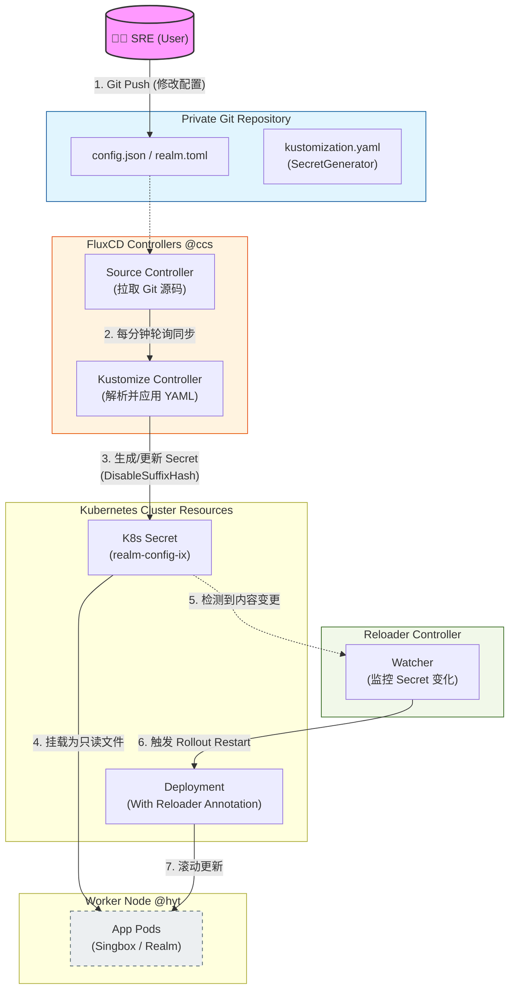

# K3s 环境下基于 FluxCD 与 Reloader 的轻量级 GitOps 实践

## 1. 背景：为什么需要 GitOps？

随着集群服务（如 Singbox、Realm）增多，手动维护 `hostPath` 挂载的配置文件变得极其低效且难以审计。为了实现“**配置即代码**”（Config as Code），我决定将敏感配置托管在私有 Git 仓库，并利用 **FluxCD** 实现自动同步，解决配置变更的“最后一公里”问题。

## 2. 技术选型：FluxCD vs ArgoCD

在边缘计算与轻量化集群（K3s）场景下，选型标准是**低开销**与**高解耦**：

| 特性 | **FluxCD** | **ArgoCD** |
| --- | --- | --- |
| **架构** | 模块化控制器，按需安装 | 集中的 API Server 与 UI |
| **开销** | 极低（适合边缘节点） | 较高（Web UI 占用资源多） |
| **管理** | 纯声明式，Git 为唯一真相来源 | 侧重可视化界面管理 |

**结论**：选择 **FluxCD**。它高度解耦，虽然学习曲线略陡，但非常符合“代码驱动”的逻辑。

---

## 3. FluxCD 核心组件与工作流

FluxCD 由多个专门的控制器组成，协同完成自动化任务：

* **Source Controller**：负责拉取外部资源（Git/Helm）。
* **Kustomize Controller**：执行器，负责解析 YAML 并应用到集群。
* **Notification Controller**：负责处理事件通知（如 Slack/钉钉告警）。

---

## 4. 部署方案：Kustomize 远程引用

我不直接使用 Flux CLI 进行 Bootstrap，而是采用 **Kustomize 远程资源引用** 方式部署。这种方式更纯净，且方便版本锁定。

### 示例：部署 Reloader

Reloader 用于监控 ConfigMap/Secret 变化并自动重启 Pod。

```yaml
# infra/reloader/kustomization.yaml
apiVersion: kustomize.config.k8s.io/v1beta1
kind: Kustomization

resources:
  # 锁定版本号是 SRE 的基本规范
  - https://github.com/stakater/Reloader/deployments/kubernetes?ref=v1.0.10 

namespace: reloader

```

> **注意**：执行部署前需手动创建 Namespace：`kubectl create ns reloader`，然后执行 `kubectl apply -k ./infra/reloader`。

---

## 5. GitOps 流水线搭建：配置与应用解耦

为了安全性，我将架构分为 **私有库（存放机密配置）** 和 **公开库（存放部署蓝图）**。

### Step 1: 对接私有 Gitea 仓库

首先创建认证 Secret：

```bash
kubectl create secret generic gitea-auth \
  --namespace=flux-system \
  --from-literal=username=<用户名> \
  --from-literal=password=<PAT令牌>

```

定义 `GitRepository` 源：

```yaml
apiVersion: source.toolkit.fluxcd.io/v1
kind: GitRepository
metadata:
  name: k3s-private-repo
  namespace: flux-system
spec:
  interval: 1m
  # 使用内网 DNS 地址，减少对公网带宽的依赖
  url: http://gitea-svc.default.svc.cluster.local:3000/k3s/k3s-private.git
  ref:
    branch: master
  secretRef:
    name: gitea-auth

```

### Step 2: 配置文件自动转 Secret (SecretGenerator)

在私有库 `k3s-private.git` 中，我们利用 Kustomize 将配置文件转化为 K8s Secret。

**目录结构示例：**

```text
├── realm
│   └── ix
│       ├── kustomization.yaml
│       └── realm_ix.toml

```

**kustomization.yaml 逻辑：**

```yaml
apiVersion: kustomize.config.k8s.io/v1beta1
kind: Kustomization

secretGenerator:
  - name: realm-config-ix
    files:
      - realm_ix.toml

# 关键：禁用哈希后缀，以便手动部署的应用能通过固定名字引用
generatorOptions:
  disableNameSuffixHash: true

```

### Step 3: 应用端引用 Secret

将原本的 `hostPath` 挂载改为 `secret` 挂载：

```diff
-  hostPath:
-    path: /opt/k3s-data/realm/config.toml 
-    type: File
+  secret:
+    secretName: realm-config-ix # 名字必须与私有库中定义的 generator 一致

```

---

## 6. 自动化闭环：Reloader 实现配置热加载

默认情况下，Secret 内容更新后，Pod 不会自动重启。引入 **Reloader** 解决最后一步。

### 原理

Reloader 监控集群内的 Secret 变更。一旦监听到 `realm-config-ix` 更新，它会自动触发关联 Deployment 的滚动更新。

### 配置

在应用的 `Deployment` 中添加注解：

```yaml
metadata:
  annotations:
    # 开启自动热加载
    reloader.stakater.com/auto: "true"

```

## 7. 架构图


---

