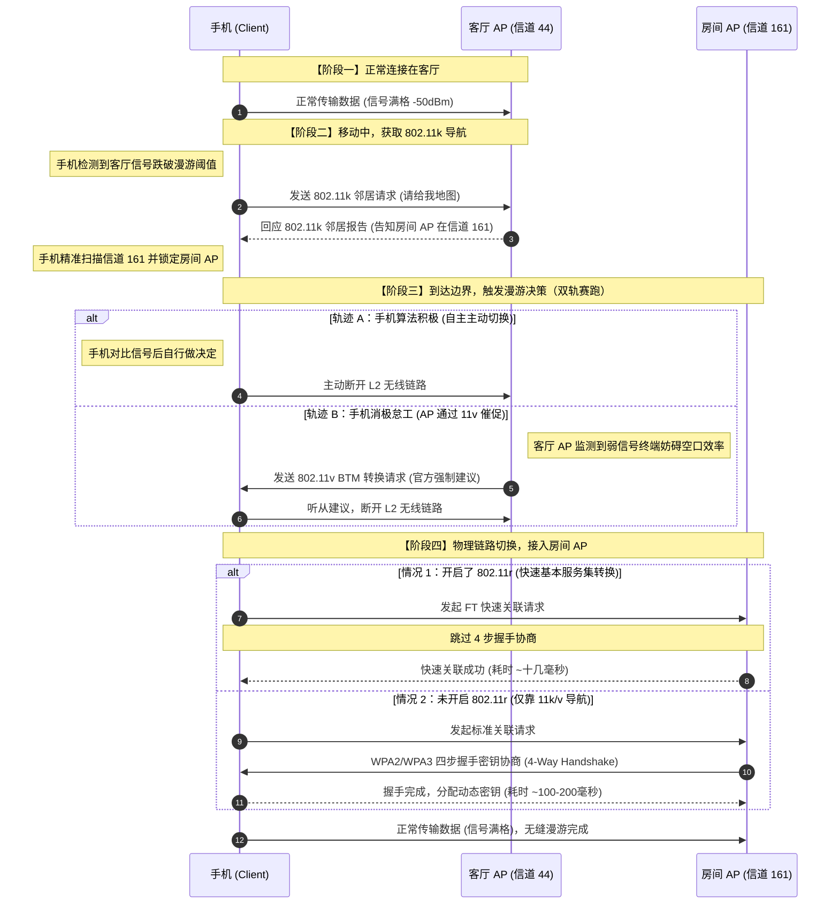

## 一、 背景与痛点：被黑盒支配的家庭网络

在接触无线网络底层协议之前，很多人（包括我）为了解决全屋 Wi-Fi 覆盖问题，盲目跟风购买了支持所谓“Mesh”的路由器。但在实际使用中，经常会遇到三个让人百思不得其解的诡异痛点：

* **伪自动切换（粘性终端）：** 明明家里两个路由器的 Wi-Fi 名字和密码设置得一模一样，但拿着手机走到房间里，信号都跌到一格了，手机还是死死咬着客厅的微弱信号不放，非得手动开关一次 Wi-Fi 才能连上身边的满格信号。
* **子网割裂（投屏屡屡失败）：** 莫名其妙地，家里设备被划分到了 `192.168.1.0/24` 和 `192.168.124.0/24` 两个不同的网段。手机和电视不在同一个局域网，导致隔三差五就搜不到投屏设备。
* **跨厂商组网壁垒：** 大家都宣传 Mesh，为什么买回来的 A 品牌就是无法和 B 品牌一键组网？难道天下就没有一个通用的标准来打破这种商业垄断吗？

## 二、 核心硬核知识：Wi-Fi 底层协议栈

想要掌握全屋 Wi-Fi 调优的主动权，必须先理清“物理基建速率”与“分布式控制协议”之间的两维关系。

### 1. IEEE 无线漫游三剑客（802.11k/v/r）

它们属于无线网络的**管理类修正案**，不决定最高网速，只负责优化终端在多个 AP（接入点）之间的协同体验。

* **IEEE 802.11k（无线资源测量协议）：** 相当于 AP 帮手机开辟的“周边雷达”。它允许手机向当前 AP 索要邻居报告，告知周围还有哪些 AP、分别在什么信道，免去手机在空间中满频段盲扫的耗时。
* **IEEE 802.11v（无线网络管理协议）：** 相当于 AP 的“交通指挥官”。当客厅 AP 发现手机信号变弱或自身负载过高时，会主动向手机下发 BTM（BSS 转换管理）帧：“你右边房间有个满格 AP，建议你立刻切过去”。
* **IEEE 802.11r（快速基本服务集转换协议 - FT）：** 相当于“免认证 ETC 闸口”。让手机在 L2（二层链路）切换 AP 时，跳过最耗时的 4 步完整身份验证密钥协商，实现毫秒级的瞬间握手。

### 2. 802.11k/v/r 漫游切换机制全景图

当我们拿着手机从客厅走到房间，底层的控制平面和数据面实际上在上演一场高效的“双轨决策赛跑”：

---

### 3. 2.4G 与 5G 的代际演进（Wi-Fi 联盟标准）

与管理协议不同，Wi-Fi 4/5/6/7 决定的是公路的最高限速和车道拓宽（物理层 PHY 改进）。其核心本质是**波长带来的物理特性差异**：2.4G 负责“广度”（波长长，穿墙绕射强，但干扰极大）；5G 负责“深度”（频宽大，速度极快，但穿墙衰减致命）。

* **Wi-Fi 4 (802.11n / 2009)：** 首次让 Wi-Fi 迈入百兆速率级别。
* **Wi-Fi 5 (802.11ac / 2013)：** 专属 5G 频段的革新，普及了 80MHz 频宽，网速迎来第一次飙升。
* **Wi-Fi 6 (802.11ax / 2019)：** 引入了类似蜂窝基站的 **OFDMA（正交频分多址）** 技术。它将信道切分成多个子格子（RU），允许一辆“货运卡车”单次同时运送多台设备的数据包，核心解决了多设备并发时的排队卡顿问题。
* **Wi-Fi 6E (2021)：** 在 Wi-Fi 6 基础上，额外开辟了一条完全无干扰的 6GHz 绿色频段通道。
* **Wi-Fi 7 (802.11be / 2024+)：** 带来 320MHz 超大频宽，最强悍的是引入 **MLO（多链路聚合）** 技术，手机可以同时连着 2.4G + 5G 两个频段叠加网速并互为备份。

---

## 三、 终极秘密：AP 之间是怎么组成邻居的？

很多人以为，只要把全家路由器的 SSID（Wi-Fi名字）、密码、加密方式改成一模一样，它们自动就变成“邻居”了。

**错！这只是拿到了手机漫游的入场券。**

要让 802.11k 邻居报告生效，客厅 AP 必须在本地内存里提前录入房间 AP 的两个核心隐私数据：**BSSID（无线网卡的 MAC 地址）** 和 **精确的工作信道**。否则，当手机来要地图时，客厅 AP 只能回复一个空表，手机被迫退化去全频段盲扫 3 秒，造成卡顿。

目前行业里实现邻居表互通有四个主要场景：

* **场景 A（同品牌 Mesh/AP 模式）：** 路由器流着相同的固件血液，会在有线/无线骨干网里跑私有的同步心跳包（如 H3C 的一键组网、Linksys 的私有协议），**自动组成 11k 邻居**。
* **场景 B（跨品牌“硬路由”混搭）：** 比如华硕搭 TP-Link。它们之间没有通用的私有心跳协议，**绝对无法自动组成邻居**。
* **场景 C（开源 OpenWrt 系统）：** 跨品牌硬件刷入 OpenWrt 后，需要手动在无线配置文件里硬编码静态录入邻居的 MAC 和信道，或者通过跑 `usteer`/`dawn` 这类群集守护进程来在网线里同步。
* **场景 D（企业级 AC+瘦 AP 架构）：** 依靠中央核心 AC 控制器拥有“全知视角”，统一将全局 AP 拓扑矩阵 Push（推送）到各个瘦 AP 的本地内存中。

---

## 四、 拨云见日：我的全屋网络改造实战

了解了上述底层逻辑后，再来看我家里（拥有两台 H3C 路由器）之前的乱象，所有问题迎刃而解。我采取了最具性价比、也最稳定的“光猫三层路由 + H3C 双胖 AP + 有线回程”的去中心化纯 AP 漫游方案。

### 1. 彻底解决“子网割裂”与投屏失败

* **原因分析：** 之前 H3C 路由器接在光猫后面时，默认工作在“路由模式”。光猫（分配 `192.168.1.0/24`）和 H3C 主路由（分配 `192.168.124.0/24`）重叠叠加，形成了 **双重 NAT**。手机连了光猫 Wi-Fi，电视连了 H3C Wi-Fi，处于不同子网，二层的多播/广播投屏协议（如 AirPlay、DLNA）被三层路由强行阻断。
* **改造方案：** 进入两台 H3C 路由器的后台，**全部切换为“AP 模式”（接入点模式 / 桥接模式）**，并关闭它们自身的 DHCP 服务。全部通过有线网线连接到光猫的 LAN 口。
* **结果：** 所有的三层路由分配、NAT 转发全部交由光猫这一个统一的网关处理。全屋设备都回到了同一个 `192.168.1.0/24` 的扁平二层大网络中，子网割裂消失，手机投屏秒成功。

### 2. 完美激活“无缝自动切换”

* **改造方案：** 在 AP 模式下，保持两台 H3C 路由器的 SSID、密码、加密算法完全一致，并手动在后台错开两者的 5G 信道（例如客厅绑定 44 信道，房间绑定 161 信道），避免同频干扰。
* **结果：** 由于是同品牌设备在同一二层网络内，H3C 固件内部的私有骨干网协议通过网线完美激活。它们在网线里成功交换了彼此的 BSSID 与信道，在本地内存中建立起了完整的 802.11k/v 邻居控制表。当我拿着手机移动时，11k/v 开始完美接力赛跑，手机实现了真正的丝滑无缝漫游。

### 3. 跨厂商组网的断舍离

* 既然跨厂商硬路由组网由于私有控制面的壁垒无法自动生成 11k 邻居表，而我又不想去折腾复杂的 OpenWrt 手动硬编码，那么**在家庭场景下，保持无线 AP 节点的整齐划一（采用同品牌生态）是最省心、排错成本最低的科学决策。**

---

## 五、 结语

网络世界不应该是盲目猜测的黑盒。当我们跳出厂商兜售的“一键 Mesh”概念噱头，下沉到 802.11k/v/r 的协议本质和二三层网络架构去思考时，就会发现：**几条百兆网线，配合正确的 AP 桥接模式设置，就能以极低的成本，亲手搭建出一个坚如磐石、体验丝滑的全屋分布式无线漫游集群。**