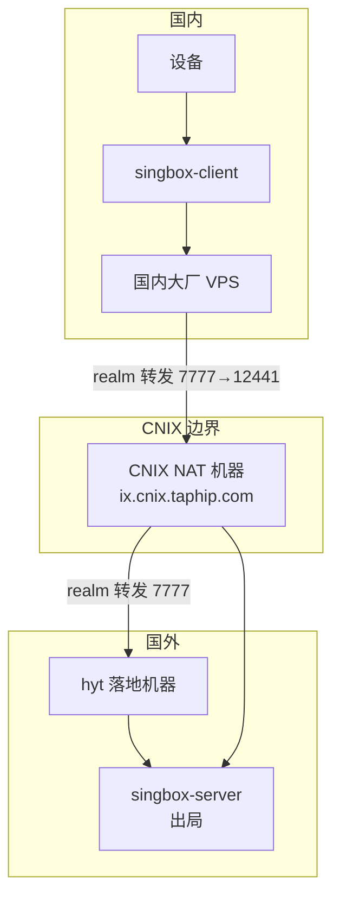

# 初探 CNIX 专线： IX 的一次体验

## 背景

最近在逛 Nodeseek 时，看到有人讨论 **IEPL 专线** 和 **IX 专线**。和常见的“线路优化”不同，这类专线是真正的网络优化方案，主要面向企业或大厂应用场景。

## 常见专线类型

* **IPLL / IPEL（International Private Leased Line / Enterprise Link）**
  国际私有专线，跨境点对点的固定带宽链路，常用于企业总部与海外分支互联。

* **IEPL（International Ethernet Private Line）**
  基于以太网接口的国际专线，更适合大带宽场景，传输灵活。

* **IX 专线（Internet Exchange 专线）**
  通过一条专线接入互联网交换中心（IXP），在 IX 平台与多个对等网络建立 BGP Peering。

  * **优势**：不必单独拉多条跨运营商专线，降低互联成本，延迟更低。
  * **不足**：通常需要依托大型运营商或数据中心资源（如阿里云、通信云、火山云等）。

## 典型 IX 平台

### CNIX（China New-type Internet eXchange，国家·深圳前海新型互联网交换中心）

* **成立**：2021 年，国家级新型 IX 试点之一。
* **定位**：不仅是传统二层互联，还强调算力网络、多云直连和 AI 合规，服务粤港澳大湾区及跨境互联。
* **特点**：

  * 国家战略级项目，受网信办/工信部支持；
  * 面向运营商、云厂商、算力平台；
  * 提供算力 VPN、AI 模型合规测试等增值服务。
* **目标**：既做互联，也支撑产业数字化。

### NNIX（National New-type Internet eXchange，国家·杭州新型互联网交换中心）

* **成立**：国家级新型 IX 试点，位于杭州。
* **定位**：服务华东与长三角，推动区域内多运营商/多云的就近互联。
* **特点**：

  * 降低跨网访问时延与丢包；
  * 优化省内及长三角互联；
  * 更偏向“传统 IX + 区域优化”。
* **目标**：打造“国内互访更顺畅”的样板。

### HKIX（Hong Kong Internet eXchange）

* **成立**：1995 年，由香港中文大学创办，是亚洲最悠久的 IX 之一。
* **定位**：香港的中立 IX 平台，亚太地区的重要枢纽。
* **特点**：

  * 非营利组织运营；
  * 汇聚大量国际运营商、CDN、云厂商；
  * 在中港台与国际互联中地位显著。
* **规模**：长期保持 Tbps 级别流量峰值。

### DE-CIX（Deutscher Commercial Internet Exchange，德国法兰克福）

* **成立**：1995 年，总部位于德国法兰克福。
* **定位**：全球最大的商业互联网交换中心。
* **特点**：

  * 法兰克福节点单点流量峰值超过 **15 Tbps**；
  * 在全球 40+ 城市运营 PoP（纽约、迪拜、孟买、马德里等）；
  * 提供 Peering、Cloud Exchange、DDoS 防护等多种增值服务。
* **地位**：欧洲乃至全球互联网的核心枢纽。

### AMS-IX（Amsterdam Internet Exchange，荷兰阿姆斯特丹）

* **成立**：1994 年，荷兰阿姆斯特丹。
* **定位**：与 DE-CIX、LINX 并列为全球三大老牌 IX。
* **特点**：

  * 非营利机构，采用会员制；
  * 全球 880+ ASN 接入，涵盖运营商、云厂商、CDN；
  * 除阿姆斯特丹外，还扩展到芝加哥、香港、加勒比海等地。
* **规模**：流量峰值长期保持在 **10 Tbps+**。

## 实现拓扑



说明：

* **sing-box** 可以替换为其他代理工具，主要承接设备端的 SOCKS/TUN 流量。
* **realm** 负责 TCP/UDP 转发，将数据包推送到目标节点。

## 关键技术
**使用Realm把前置流量转发到IX前置**，是最重要的。其他细节不作介绍。

### Realm 转发

[Realm 仓库地址](https://github.com/zhboner/realm)
一个用 Rust 实现的高性能网络转发工具，支持 TCP+UDP。

### 一键安装脚本

感谢 [hiapb](https://github.com/hiapb/hia-realm) 大佬提供的一键脚本，几乎开箱即用。需要注意的是，`REALM_URL` 里的版本最好更新到最新。

```bash
#!/bin/bash
CONFIG_FILE="/etc/realm/config.toml"
REALM_BIN="/usr/local/bin/realm"
SERVICE_FILE="/etc/systemd/system/realm.service"
REALM_URL="https://github.com/zhboner/realm/releases/download/v2.9.2/realm-x86_64-unknown-linux-musl.tar.gz"
TMP_DIR="/tmp/realm-install"

GREEN="\e[32m"
RED="\e[31m"
RESET="\e[0m"

check_root() {
    if [ "$EUID" -ne 0 ]; then
        echo -e "${RED}请以 root 用户运行此脚本。${RESET}"
        exit 1
    fi
}

install_realm() {
    echo -e "${GREEN}正在安装 Realm TCP+UDP转发脚本...${RESET}"
    mkdir -p "$TMP_DIR"
    cd "$TMP_DIR" || exit 1
    curl -L -o realm.tar.gz "$REALM_URL"
    tar -xzf realm.tar.gz
    mv realm "$REALM_BIN"
    chmod +x "$REALM_BIN"

    cat > "$SERVICE_FILE" <<EOF
[Unit]
Description=Realm Proxy
After=network.target

[Service]
ExecStart=$REALM_BIN -c $CONFIG_FILE
Restart=always
LimitNOFILE=1048576

[Install]
WantedBy=multi-user.target
EOF

    mkdir -p $(dirname "$CONFIG_FILE")
    echo "# 默认配置" > "$CONFIG_FILE"

    systemctl daemon-reexec
    systemctl enable realm
    systemctl restart realm
    echo -e "${GREEN}Realm 安装完成。${RESET}"
}

uninstall_realm() {
    systemctl stop realm
    systemctl disable realm
    rm -f "$REALM_BIN" "$SERVICE_FILE" "$CONFIG_FILE"
    systemctl daemon-reexec
    echo -e "${GREEN}Realm 已卸载。${RESET}"
}

restart_realm() {
    systemctl restart realm
    echo -e "${GREEN}Realm 已重启。${RESET}"
}

add_rule() {
    read -p "请输入监听端口: " LISTEN
    read -p "请输入远程目标 IP:PORT: " REMOTE
    cat >> "$CONFIG_FILE" <<EOF

[[endpoints]]
listen = "0.0.0.0:$LISTEN"
remote = "$REMOTE"
type = "tcp+udp"
EOF
    restart_realm
    echo -e "${GREEN}已添加规则并重启 Realm。${RESET}"
}

delete_rule() {
    RULES=($(grep -n '\[\[endpoints\]\]' "$CONFIG_FILE" | cut -d: -f1))
    COUNT=${#RULES[@]}
    if [ "$COUNT" -eq 0 ]; then
        echo "${RED}无可删除规则。${RESET}"
        return
    fi
    echo "当前转发规则："
    for ((i=0; i<COUNT; i++)); do
        START=${RULES[$i]}
        END=${RULES[$((i+1))]:-99999}
        BLOCK=$(sed -n "$START,$((END-1))p" "$CONFIG_FILE")
        echo -e "$((i+1)). $(echo "$BLOCK" | grep listen | cut -d'"' -f2) -> $(echo "$BLOCK" | grep remote | cut -d'"' -f2)"
    done
    read -p "请输入要删除的规则编号: " IDX
    IDX=$((IDX-1))
    if [ "$IDX" -lt 0 ] || [ "$IDX" -ge "$COUNT" ]; then
        echo "${RED}编号无效。${RESET}"
        return
    fi
    START=${RULES[$IDX]}
    END=${RULES[$((IDX+1))]:-99999}
    sed -i "$START,$((END-1))d" "$CONFIG_FILE"
    restart_realm
    echo -e "${GREEN}规则已删除并重启 Realm。${RESET}"
}

clear_rules() {
    sed -i '/\[\[endpoints\]\]/,/^$/d' "$CONFIG_FILE"
    restart_realm
    echo -e "${GREEN}已清空所有规则并重启 Realm。${RESET}"
}

list_rules() {
    echo "${GREEN}当前转发规则：${RESET}"
    grep -A3 '\[\[endpoints\]\]' "$CONFIG_FILE" | sed '/^--$/d'
}

view_log() {
    journalctl -u realm --no-pager --since "1 hour ago"
}

view_config() {
    cat "$CONFIG_FILE"
}

main_menu() {
    check_root
    while true; do
        echo -e "${GREEN}===== Realm TCP+UDP 转发脚本 =====${RESET}"
        echo "1. 安装 Realm"
        echo "2. 卸载 Realm"
        echo "3. 重启 Realm"
        echo "--------------------"
        echo "4. 添加转发规则"
        echo "5. 删除单条规则"
        echo "6. 删除全部规则"
        echo "7. 查看当前规则"
        echo "8. 查看日志"
        echo "9. 查看配置"
        echo "0. 退出"
        read -p "请选择一个操作 [0-9]: " OPT
        case $OPT in
            1) install_realm ;;
            2) uninstall_realm ;;
            3) restart_realm ;;
            4) add_rule ;;
            5) delete_rule ;;
            6) clear_rules ;;
            7) list_rules ;;
            8) view_log ;;
            9) view_config ;;
            0) exit 0 ;;
            *) echo -e "${RED}无效选项。${RESET}" ;;
        esac
    done
}

main_menu
```
### 配置与日志

有时需要调试，y一件脚本不支持修改。可以在 `/etc/realm/config.toml` 中修改日志级别，例如：

```toml
[log]
level = "debug"
output = "/var/log/realm.log"

[[endpoints]]
listen = "0.0.0.0:7777"
remote = "ix.cnix.taphip.com:1111"
type = "tcp+udp"
```

## 写在最后

IX 专线由于只面向大厂开放，理论上稳定性会比 IEPL 等直接暴露公网入口/出口的专线更好。
这次只是一次学习和尝试，同时也顺带了解了全球几大典型 IX：**CNIX、NNIX、HKIX、DE-CIX、AMS-IX**。
未来如果有机会实测更多场景，希望能分享更深入的经验。
