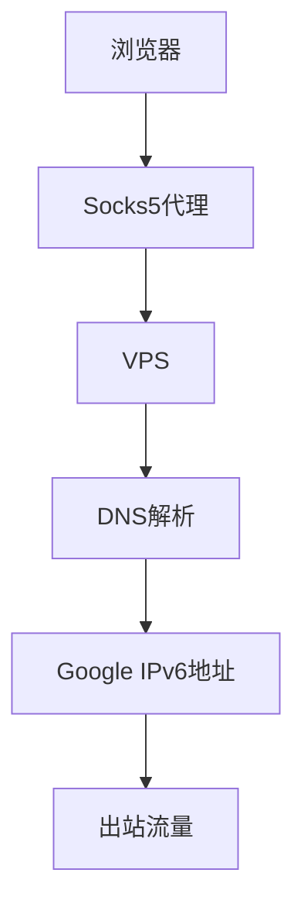
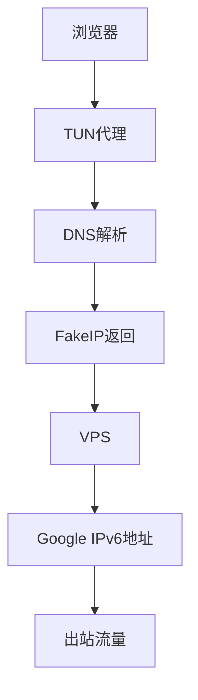
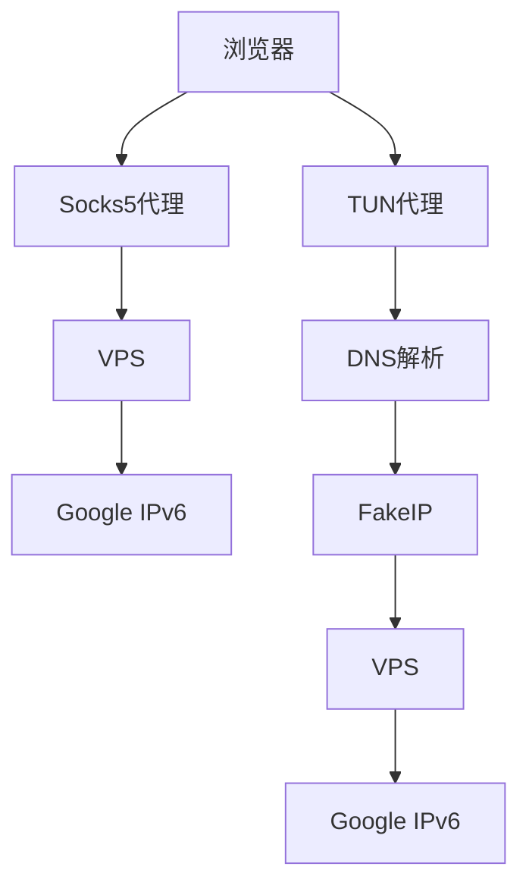

## singbox使用fakeip让谷歌流量通过IPv6出站

### 背景

最近购买了香港的Hytron机器，作为解锁工具使用，流媒体服务已经能够正常解锁。但是，发现Google判定IPv4地址为中国地区IP，导致Google Music无法使用，并且切换回中国后Google的登录状态出现异常。为了解决这个问题，我决定让Google流量通过Hytron的IPv6出站，从而避免Google流量被错误判定为中国地区流量。

### 前置条件

* 我统一使用IPv4进行翻墙处理，IPv6地址并非所有地方都支持，因此大部分情况不使用IPv6。只有在VPS访问外网时，IPv4和IPv6同时出站。
* 配置基于SingBox 1.12.x版本。

### 翻墙原理

#### 场景一：PC通过Socks5代理

对于PC端浏览器，只需配置Socks5代理即可实现流量通过VPS出站。

**DNS解析流程：**

* 浏览器访问：[www.google.com](http://www.google.com) -> 浏览器直接连接至Socks5代理，不进行DNS解析 -> VPS -> VPS通过DNS解析获取目标IP地址。

**访问阶段：**

* 浏览器访问：[www.google.com](http://www.google.com) -> 获取到IP地址后，通过Socks5代理连接至VPS -> VPS将流量发出。



#### 场景二：手机通过TUN代理

手机通过TUN虚拟网卡接管L3/L4层流量，对于应用而言，代理的存在是透明的。

**DNS解析流程：**

* 浏览器访问：[www.google.com](http://www.google.com) -> 启动DNS解析 -> TUN虚拟网卡接管流量，截取DNS请求并转发至SingBox的DNS模块 -> SingBox通过DoH将请求发送至VPS -> VPS获取到Google的地址并返回给浏览器。

**访问阶段：**

* 浏览器访问：[www.google.com](http://www.google.com) -> 已获取IP地址后，通过TUN虚拟网卡将流量引导至VPS -> 根据规则选择出口进行连接。


### 控制IPv6出站的细节

#### 分流要点：

* 通常我会使用IPv4进行翻墙处理，因为大部分区域和应用只支持IPv4地址。
* 若希望将Google流量通过IPv6分流，则需要确保DNS解析阶段返回Google的IPv6地址。否则，无法通过IPv6出站。

为此，使用FakeIP是最简单的方式。在墙内阶段，首先将FakeIP返回给客户端进行DNS解析，之后在VPS出站时，SingBox会重新发起DNS解析，确保通过IPv6进行访问。

#### 场景一：PC通过Socks5代理

**客户端：** 无需修改。

**服务端配置：** 当Google域名进行DNS解析时，通过指定IPv6的DNS服务器进行解析。

```json
"dns": {
    "servers": [
      {
        "tag": "dns-ipv6",
        "type": "udp",
        "server": "8.8.8.8",
        "detour": "out-ipv6"
      },
      {
        "tag": "dns-ipv4",
        "type": "local"
      }
    ],
    "rules": [
      {
        "rule_set": [
          "geosite-google",
          "geoip-google",
          "geosite-youtube"
        ],
        "server": "dns-ipv6"
      }
    ],
    "final": "dns-ipv4",
    "strategy": "prefer_ipv4"
  },
  "route": {
    "rules": [
      {
        "action": "sniff"
      },
      {
        "protocol": "dns",
        "action": "hijack-dns"
      },
      {
        "rule_set": [
          "geosite-google",
          "geoip-google",
          "geosite-youtube"
        ],
        "outbound": "out-ipv6"
      }
    ],
    "rule_set": [
      {
        "tag": "geoip-netflix",
        "type": "remote",
        "format": "binary",
        "url": "https://github.com/MetaCubeX/meta-rules-dat/raw/refs/heads/sing/geo/geoip/netflix.srs",
        "download_detour": "out-ipv4"
      },
      {
        "tag": "geosite-netflix",
        "type": "remote",
        "format": "binary",
        "url": "https://github.com/MetaCubeX/meta-rules-dat/raw/refs/heads/sing/geo/geosite/netflix.srs",
        "download_detour": "out-ipv4"
      },
      {
        "tag": "geosite-google",
        "type": "remote",
        "format": "binary",
        "url": "https://github.com/MetaCubeX/meta-rules-dat/raw/refs/heads/sing/geo/geosite/google.srs",
        "download_detour": "out-ipv4"
      },
      {
        "tag": "geoip-google",
        "type": "remote",
        "format": "binary",
        "url": "https://github.com/MetaCubeX/meta-rules-dat/raw/refs/heads/sing/geo/geoip/google.srs",
        "download_detour": "out-ipv4"
      },
      {
        "tag": "geosite-youtube",
        "type": "remote",
        "format": "binary",
        "url": "https://github.com/MetaCubeX/meta-rules-dat/raw/refs/heads/sing/geo/geosite/youtube.srs",
        "download_detour": "out-ipv4"
      }
    ],
    "final": "out-ipv4",
    "auto_detect_interface": true,
    "default_domain_resolver": "dns-ipv4"
  }
```

#### 场景二：手机通过TUN代理

**客户端：** 设置Google域名使用FakeIP。

```json
    "dns": {
        "servers": [
            {
                "tag": "dns-local",
                "type": "udp",
                "server": "223.5.5.5",
                "detour": "out-direct"
            },
            {
                "tag": "dns-public",
                "type": "https",
                "server": "dns.alidns.com",
                "domain_resolver": "dns-local"
            },
            {
                "tag": "dns-proxy",
                "type": "h3",
                "server": "8.8.8.8",
                "detour": "out-proxy"
            },
            {
                "tag": "dns-fakeip",
                "type": "fakeip",
                "inet4_range": "198.18.0.0/15",
                "inet6_range": "fc00::/18"
            }
        ],
        "rules": [
            {
                "rule_set": [
                    "geosite-category-ads-all"
                ],
                "action": "reject"
            },
            {
                "query_type": [
                    "A",
                    "AAAA"
                ],
                "rule_set": [
                    "geosite-google",
                    "geoip-google"
                ],
                "server": "dns-fakeip"
            },
            {
                "domain": [
                    "services.googleapis.cn"
                ],
                "server": "dns-proxy"
            },
            {
                "rule_set": "geosite-geolocation-cn",
                "server": "local"
            },
            {
                "type": "logical",
                "mode": "and",
                "rules": [
                    {
                        "rule_set": "geosite-geolocation-!cn",
                        "invert": true
                    },
                    {
                        "rule_set": "geoip-cn"
                    }
                ],
                "server": "dns-proxy",
                "client_subnet": "223.5.5.5/24"
            }
        ],
        "final": "dns-proxy",
        "strategy": "ipv4_only"
    }
```

**服务端：** 在VPS端对Google域名的DNS解析同样需要使用IPv6 DNS服务器进行解析。

使用TUN代理后，应用程序会默认触发本地DNS解析，为了模拟Socks5的行为，必须在本机返回一个虚假的域名解析地址（FakeIP），以确保流量通过IPv6出口。

---

### Mermaid图示


