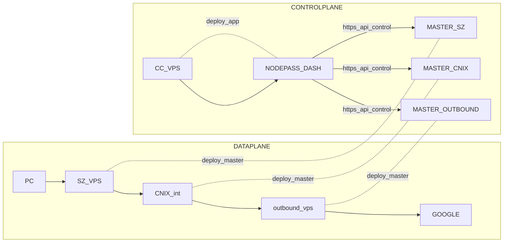

# 🚀 NodePass 新手入门教程

## 📌 背景介绍

目前我的代理链路结构为：

```
阿里云（入口） → IX 中转 → 落地 VPS
```

过去一直使用 **realm** 做 TCP/UDP 转发，但现实痛点包括：

1. **所有节点都需要手工 SSH 登录修改配置，运维复杂**
2. **缺乏端口/实例级别的流量与连接监控，仅能看到机器级别监控**
3. **转发链路拓扑难以可视化**

因此开始寻找可观测性更强、运维自动化程度更高的转发方案。

市面上开源的两个主流转发面板是：

### ✔ NodePass

[https://github.com/yosebyte/nodepass](https://github.com/yosebyte/nodepass)

**优点：**

* 转发组件由纯 Go 实现，依赖极少，部署轻量
* 前后端分离，易于自定义面板 / 自托管
* 支持 Docker / 二进制混合部署
* 架构灵活，server-client 模型可实现中转链路/内网穿透
* 更新维护稳定、社区活跃

**缺点：**

* 目前不支持多用户

---

### ✔ 哆啦A梦转发面板

[https://github.com/bqlpfy/flux-panel](https://github.com/bqlpfy/flux-panel)

**优点：**

* 原生支持多用户

**缺点：**

* 作者曾删库，维护稳定性存在疑问
* 依赖 `go-gost` / `go-gost/x`（链路复杂度高）
* 后台为 Java + MySQL，部署较重

综合对比后，最终选择 **NodePass**。

---

# 🧠 NodePass 关键概念（新手必须理解）

NodePass 由三种运行模式组成：

## 1. **Master（主控 / 控制平面）**

* 提供 RESTful API
* 用来管理 server / client 实例
* 由 NodePassDash（前端）进行调用

Master **不参与数据转发**，只负责下发配置与管理实例。

---

## 2. **Server（服务端 / 入口端）**

负责以下任务：

* 监听来自 Client 的连接
* 当有请求进入 server 时，将请求转发给一个可用的 client 执行
* 在 server-client 架构中，server 始终是“入口”

📌 **Server 不能单独工作，必须有 Client 连接它。**

---

## 3. **Client（客户端 / 出口端）**

* 主动连接 Server（适用于内网/无公网）
* 接受 server 分配的任务，执行真实请求
* 可直接作为“转发节点”，本地监听端口并转发

📌 Client **既可以接收 server 的流量，也可以直接对接本地其他服务程序**（例如反代、端口转发）。

---

### 🔧 总结一句话：

| 角色         | 功能                    | 是否可单独转发       |
| ---------- | --------------------- | ------------- |
| **Master** | 管理实例                  | ❌             |
| **Server** | 等待 Client 并转发         | ❌（必须有 Client） |
| **Client** | 主动连接 Server 或直接监听端口转发 | ✔             |

这就是为什么：

* **Server ↔ Server 不可互联**
* **Server ↔ Client 必须成对出现**
* **纯 Client 模式可以完成大多数转发**

---

# 🏗️ 架构设计（推荐新手阅读）

NodePass 架构分成 **控制平面（Control Plane）** 和 **数据平面（Data Plane）**：

---

## 🔷 数据平面（Data Plane）

你的真实流量从入口到落地的链路，例如：

```
用户 → SZ VPS → IX VPS → 出口 VPS → Google
```

这部分完全由 server / client 实例完成，Dash 不参与。

---

## 🔶 控制平面（Control Plane）

主要负责管理每台机器的 master：

```
控制 VPS（CC） → NodePassDash → 各主控（Master）
```

你在控制 VPS（CC）部署 NodePassDash，通过 API 统一管理所有分布式节点。

---

### 📈 架构示意（Mermaid）



---

# 🛠️ 部署指南（新手可直接照做）

## 🟦 面板部署（NodePassDash）

我使用 Docker + Cloudflare Tunnel 暴露 Dash（无需自己管理 HTTPS 证书）。

```yml
services:
  nodepassdash:
    image: ghcr.io/nodepassproject/nodepassdash:latest
    container_name: nodepassdash
    volumes:
      - /etc/localtime:/etc/localtime:ro 
      - ./db:/app/db
    restart: unless-stopped
    expose:
      - "3000"
    networks:
      - vw-net

  cloudflared:
    image: cloudflare/cloudflared:latest
    restart: unless-stopped
    environment:
      - TUNNEL_TOKEN=XXXX
    command: tunnel --no-autoupdate run
    depends_on:
      - nodepassdash 
    networks:
      - vw-net

networks:
  vw-net:
    driver: bridge
```

> 初始化用户名/密码会在容器日志中输出。

---

## 🟩 普通主控部署（带公网）

主控负责下发配置，使用 Docker 最方便。

注意事项：

* 建议开启 TLS（`&tls=1`）提升安全性
* 推荐使用 `network_mode: host`（NodePass 需要绑定任意端口）

```yml
services:
  npmaster:
    image: ghcr.io/yosebyte/nodepass:latest
    container_name: npmaster
    environment:
      - TZ=Asia/Shanghai
    command:
      - master://0.0.0.0:9090?log=info&tls=1
    network_mode: host
    volumes:
      - ./nodepass-master-data:/gob
    restart: unless-stopped
```

部署成功后，访问日志中会看到：

```
API Key created: xxxxxxxxxxxxx
```

把 API Key 填入 Dash 即可。

---

## 🟨 内网主控部署（如 IX VPS）

IX 无公网，无法被 Dash 直接访问，因此必须依赖 Cloudflare Tunnel。

配置要点：

* 内网 master：关闭 TLS（`&tls=0`）
* Cloudflared 通过 `host.docker.internal` 访问宿主网络
* 用 config.yml 指定本地路由

### docker-compose.yml

```yml
services:
  npmaster:
    image: ghcr.io/yosebyte/nodepass:latest
    container_name: npmaster
    environment:
      - TZ=Asia/Shanghai
    command: 
      - master://0.0.0.0:9090?log=info&tls=0
    network_mode: host
    volumes:
      - ./nodepass-master-data:/gob
    restart: unless-stopped

  cloudflared:
    image: cloudflare/cloudflared:latest
    restart: unless-stopped
    environment:
      - TUNNEL_TOKEN=XXX
    depends_on:
      - npmaster
    extra_hosts:
      - "docker.internal:host-gateway"
    volumes:
      - ./config.yml:/etc/cloudflared/config.yml:ro
```

### config.yml

```yaml
ingress:
  - hostname: npmaster.yourdomain.org
    service: http://docker.internal:9090

  - service: http_status:404
```

CF → docker.internal → 宿主机 → NodePass API
链路即可打通。

---

# 🔗 实例串联（Data Plane）

由于我的节点都可以互相访问，不需要 server-client 链式代理，**全部使用 client 模式即可完成中转**。

如果需要：

* 负载均衡
* 多节点 relay（A → B → C）
* 内网穿透

则需要合理组合 server-client，但不是本教程范围。

---

# 🎉 总结 / 后记

NodePass 结构清晰、轻量、易于扩展。
通过 Master + Dash，可以把所有节点的转发配置集中化管理，彻底解决：

* 手写转发配置
* 手工 SSH 部署
* 端口/流量不可观测
* 节点分散运维

> Just have fun.
> 希望本文能帮助你更好地理解 NodePass 的架构与部署方式。
